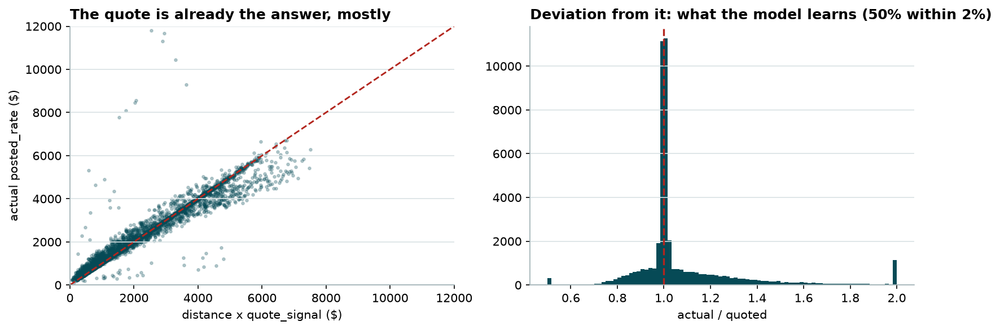
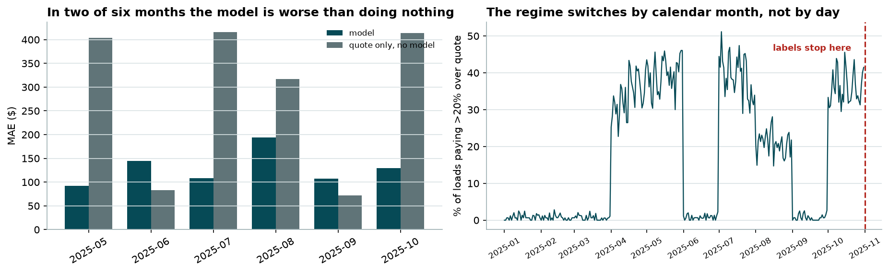
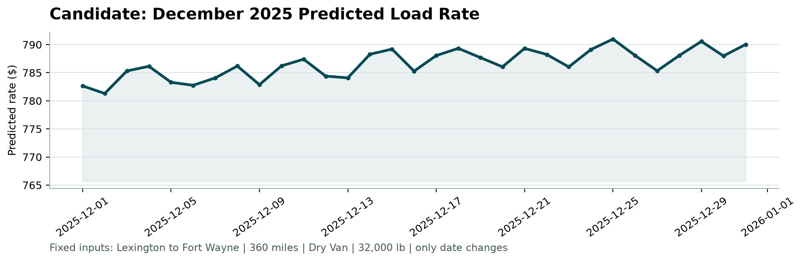
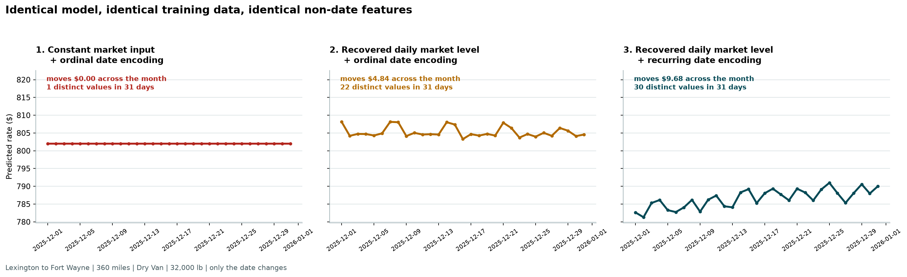

# Freight Rate Prediction

Predicting `posted_rate` for 12,000 held-out loads, and producing the fixed December
chart. Every figure below is a measurement produced by code in this repository; the
walkthrough that generates them is
[`notebooks/01_walkthrough.ipynb`](../notebooks/01_walkthrough.ipynb).

**Result.** MAE **$128.97** on pooled out-of-fold predictions, **55.0% below** the
`distance × quote_signal` baseline, with **93.0%** of loads priced within 10%.

---

## 1. Task and validation design

48,000 labelled loads January to October, 12,000 unlabelled November and December. The
holdout is strictly forward in time, which rules out random cross-validation before any
modelling decision is made: daily median rate-per-mile carries lag-1 autocorrelation of
+0.844, so a shuffled split trains on Tuesday and tests on Wednesday while both share a
market level.

| Strategy | MAE | RMSE | MAPE | median APE |
|---|---|---|---|---|
| Forward chaining (honest) | $128.93 | $636.27 | 5.70% | 2.39% |
| Random k-fold (optimistic) | $94.13 | $591.54 | 4.28% | 1.37% |

Random k-fold understates MAE by **37.0%**. Three expanding-window folds with two-month
test blocks mirror the real Jan-Oct → Nov-Dec shape; every score in this report comes
from them.

## 2. What the data said

Five findings changed the design. Everything else is in the notebook.

**`quote_signal` is multiplicative, not additive.** Its linear correlation with
`posted_rate` is −0.04, which reads as useless. Multiply it by `distance` and it lands
within 2% of the actual rate on **half** the loads with no model at all.



That reframes the task: the model is given the *deviation* to learn, not the rate.

**The target has a long right tail.** Median $2.15/mile, but 0.7% of loads run past $4
and reach $14. Skew of the actual/quoted ratio is 6.64; in log space it is 0.96. Hence
the target `log(posted_rate / (distance × quote_signal))`, which keeps 0.7% of rows from
dominating a squared-error loss.

**`market_index` is a daily series wearing a per-load disguise.** ~155 distinct values on
a day with ~157 loads, but **97.8%** of its variance is explained by date alone, and the
2.2% left over correlates with nothing about the load. Averaging a date's loads recovers
that day's level to ±0.002. This is what makes the December chart possible at all, since
`december_chart_inputs.csv` ships without the column.

**Eight cities appear only at prediction time** (Allentown, Charlotte, Chicago, Jackson,
Knoxville, Laredo, Norfolk, San Diego), out of 72. Any encoding built on city *names*
meets an unseen category in production.

**The market shifts between the two windows.** Train mean 1.08 against validation 0.93,
and validation never reaches the upper half of training's range, so whatever the model
learns up there is unusable.

## 3. Pipeline

| Stage | Module | Does |
|---|---|---|
| Load | `loading.py` | CSV reads with schema enforcement, so a renamed column fails as itself |
| Clean | `cleaning.py` | Sign errors and gaps, as pure transforms with nothing learned |
| Recover | `market.py` | Daily market level from per-load `market_index` |
| Features | `features/` | 15 columns in three blocks: load, geography, temporal |
| Target | `modeling/target.py` | Log-ratio transform and its inverse |
| Fit | `modeling/estimator.py` | RandomForest, plus train-only median imputation |
| Validate | `modeling/splits.py`, `evaluation/metrics.py` | Forward chaining, and the random-fold contrast |
| Evaluate | `evaluation/report.py` | Full metric panel, segments, baselines, diagnostics |
| Deliver | `december.py`, `cli.py` | The chart and the two prediction files |

## 4. Data quality

| Issue | Train / validation | Handling |
|---|---|---|
| Negative `weight` | 292 / 145 | **Sign errors, not corruption.** Their absolute values track the positive rows across the distribution (median 31,822 against 31,494 lb; quartiles 25,928/37,284 against 25,922/37,063), so the magnitude is trustworthy and only the sign is wrong. `abs()` is applied and no flag is kept |
| Missing `weight` | 300 / 165 | Imputed **in `RateModel.fit`** from training medians (31,496 lb), reused unchanged at predict time |
| Missing `market_index` | 374 / 249 | Filled from the same date's mean, justified by the 97.8% finding above |
| Rate outliers | ~0.7% above $4/mile | Kept. The log-ratio target contains them |

**Where imputation lives is the point.** RandomForest cannot read NaN, so the blanks must
be filled. Doing it in cleaning would compute the median across all 60,000 rows, letting
November and December help set the number used to fill their own blanks. The gap is small
here (31,496 against 31,467 lb pooled) but a fill value is a *fitted parameter*, so it
belongs in `fit`. `predict` only reads it back and never computes a median, so it cannot
peek even by accident.

Filling with a median is safe because the rows missing a weight are not otherwise
unusual: they price like the rest (median $/mile 2.1176 against 2.1456, Mann-Whitney
p = 0.234) and match on equipment mix to within 2 points.

## 5. Feature engineering

15 columns. Nothing is included by convention; each derived column survived an ablation
on the forward folds.

| Column | Block | Why |
|---|---|---|
| `distance`, `quote_signal`, `market_index`, `weight` | load | Supplied. `quote_signal` is the dominant signal and also half the target's baseline |
| `is_dry_van`, `is_reefer`, `is_flatbed` | load | One indicator per trailer type |
| 4 × pickup/delivery lat-lon | geography | Lane identity, which `distance` cannot carry |
| `haversine` | geography | Great-circle miles between the two ends |
| `day_of_week`, `day_of_month`, `daily_market_level` | temporal | Date features that recur, so December lands in range |

**Importance, measured by permutation on the last fold:**

| Feature | Share |
|---|---|
| `quote_signal` | **80.8%** |
| `distance` | 7.8% |
| `haversine` | 6.5% |
| `is_dry_van` | 3.0% |
| `weight`, `is_reefer` | 1.6% combined |
| everything else | ~0% |

Two readings matter here. The coordinates score ~0% and that is **wrong**: it is the known
failure of permutation importance under correlated features, since permuting one
coordinate leaves three others that still pin the lane down. Dropping all four costs
**+3.86 MAE (±0.34)**, same sign in all three folds, and the ablation is what the decision
rests on. And `quote_signal` at 81% is why `max_features` is restricted (§7): with one
feature this strong, every tree splits on it first and the forest ends up correlated,
which is the one thing averaging cannot repair.

**Rejected, with the cost of keeping them:**

| Candidate | Measured |
|---|---|
| `log(distance)` | Trees split on thresholds, so a monotone transform gives identical splits |
| Bearing, `dlat`, `dlon` | +0.51 MAE (±0.23), sign varies by fold |
| sin/cos day-of-week | +0.58 MAE (±0.15) against a plain integer |
| Missing-weight flag | Nothing to carry: those rows price like the rest |
| City name categories | Meets 8 unseen categories at prediction time |

## 6. Encoding

**Equipment: one indicator per type.** A tree can isolate a category from an integer code
only as a contiguous run, so the code's *order* decides which single splits exist.

| Encoding | Cost against indicators |
|---|---|
| Arbitrary integer codes | **+1.74 MAE (±0.26)**, same sign in all folds |
| Codes ordered by median rate | +0.80 MAE, sign varies |

Reordering recovers most of the gap but not all, so the ordering was most of the problem
and the representation is the rest. Indicators assume no ordering at all.

**Dates: recurring, not ordinal.** Training ends 2025-10-31; the chart asks for December.
A tree cannot extrapolate past a threshold it never saw.

| Encoding | Feature | Training range | December | In range? |
|---|---|---|---|---|
| Ordinal | `date_ordinal` | 0-303 | 334-364 | no |
| | `month` | 1-10 | 12 | no |
| Recurring | `day_of_week` | 0-6 | 0-6 | yes |
| | `day_of_month` | 1-31 | 1-31 | yes |
| | `daily_market_level` | 0.77-1.40 | 0.83-1.04 | yes |

Ordinal costs **34% MAE** ($173.18 against $128.93) and flattens the December chart to a
single value.

**Geography: coordinates, never names.** Fixed per city and supplied for every city, so
they cover the eight that appear only at prediction time.

## 7. Model selection

Thirteen configurations at sensible defaults, then the three leading families tuned over
comparable grids: roughly 130 fits. Every column uses training-median imputation,
including for models that read NaN natively, so the comparison is like for like.

| Model | MAE | Chart shape | Where it fails |
|---|---|---|---|
| ExtraTrees (tuned) | **128.28** | +0.153 | Best average, but the margin **reverses by fold** (−3.41, +4.43, −2.97) |
| **RandomForest (tuned)** | 128.93 | +0.233 | Selected |
| LightGBM (tuned) | 131.06 | +0.237 | −$2.13 MAE, no compensating strength |
| HistGradientBoosting (tuned) | 135.57 | +0.204 | Loses by **$6.64 (±0.61)**, same sign in all three folds |
| ElasticNet (tuned) | 148.23 | **+0.382** | Best chart shape, pays **15% on MAE** |

Also benchmarked and not competitive: XGBoost (133.43), GradientBoosting (149.52), Ridge
(152.85), KNeighbors k=25 (187.45), two superseded HGB hand-tunings (144.18, 152.26), the
quote alone (286.20) and a mean predictor (329.24).

**How the winner was picked.** Forward-chained MAE decides, with per-fold sign
consistency as the tiebreak.

- Against boosting the margin is decisive: $6.64 (±0.61) over HistGradientBoosting with
  the same sign in every fold.
- ExtraTrees has the **lower** pooled MAE by $0.64 (±0.43), but the sign varies by fold:
  much better on folds 1 and 3, clearly worse on fold 2, the hardest block. An edge that
  reverses on one of three time windows will not carry into an unseen month, so
  RandomForest takes it on **stability rather than average**.
- ElasticNet leads the chart column and the lead is real, since it is the only candidate
  that extrapolates past the training horizon. It is not enough to pay 15% of MAE for.
- **The chart column cannot decide this.** Edits unrelated to dates have moved
  HistGradientBoosting's score across +0.295, +0.074, +0.137 and +0.204. A column that
  reorders under unrelated edits cannot carry a model decision, so MAE does.

Tuning found one lever that generalised: **feature subsampling**, for every tree family.
`max_features=8` of 15 is the single largest win in the search. `min_samples_leaf=20`
survived its own sweep, 400 trees is where more stops helping, and `absolute_error`,
`ccp_alpha`, `max_depth` and `max_samples` were all tried without a gain that held.

RandomForest is the best *single* model here, not the best available answer. An ensemble
weighted toward constrained models on the hardest block is the obvious next step and was
not attempted.

## 8. Results

Pooled out-of-fold predictions: the three forward folds concatenated, 28,890 loads from
May to October, each scored by a model trained only on earlier months.

| | model | quote only | mean rate |
|---|---|---|---|
| MAE $ | **128.97** | 286.37 | 1,183.74 |
| RMSE $ | 636.26 | 726.69 | 1,521.83 |
| bias $ | −64.91 | −59.71 | 0.00 |
| MAPE % | 5.70 | 13.97 | 83.51 |
| median APE % | 2.30 | 7.04 | 43.55 |
| P90 APE % | 8.13 | 33.21 | 197.55 |
| WAPE % | 5.35 | 11.88 | 49.12 |
| bias % | −2.69 | −2.48 | 0.00 |
| R² | 0.83 | 0.77 | 0.00 |
| within 5% | 78.2 | 44.9 | 5.5 |
| within 10% | **93.0** | 56.7 | 10.9 |
| within 25% | 98.3 | 82.5 | 26.7 |

`quote only` is the baseline that matters: a **55.0% MAE cut** against the number a broker
already has. R² is reported because it is expected and decides nothing, since
`posted_rate` scales with trip length and `distance` alone explains most of its variance.

**By segment**, the error is not spread evenly:

| Cut | Worst | Best | Reading |
|---|---|---|---|
| Equipment | Reefer $154.76 | Dry Van $117.37 | A tail difference, not a level one: median APE 2.80 against 2.07, P90 10.47 against 7.13 |
| Distance | 1000+ mi $190.87 | under 250 mi $39.39 | Reverses in percent: P90 APE 7.03 against 20.94. Short loads are small, so a large proportional miss is a small dollar miss |

## 9. What the pooled metrics hid

**Direction.** The model quotes **2.69% low** on dollars, and MAE is structurally
incapable of showing it. The cause is the target transform: the forest fits the *mean* of
the log ratio, and exponentiating a mean lands below the mean of the exponentials by
about `exp(σ²/2)`, measured at 1.30 of the 3 points.

| | MAE $ | bias $ | bias % |
|---|---|---|---|
| As shipped | **128.97** | −64.91 | −2.69 |
| Duan smearing-corrected | 137.26 | +11.59 | +0.48 |

Correcting it costs **$8.29 MAE**, because exponentiating an unbiased log-space fit gives
a conditional *median* and the median is what minimises absolute error. It ships
uncorrected since the assessment scores MAE. For a revenue forecast rather than a
per-load quote, the correction belongs back in.

**Regime.** The training year holds two regimes, and in one of them the model is **worse
than no model at all**.



| Month | model MAE | quote-only MAE | loads >20% over quote |
|---|---|---|---|
| 2025-05 | 91.88 | 403.40 | 39.8% |
| 2025-06 | **144.56** | **82.85** | 0.8% |
| 2025-07 | 107.96 | 415.77 | 39.2% |
| 2025-08 | 194.00 | 317.26 | 20.9% |
| 2025-09 | **107.03** | **71.75** | 0.7% |
| 2025-10 | 129.76 | 413.72 | 36.0% |

In January, February, March, June and September the quote is essentially exact and there
is no deviation to predict; the model predicts one anyway and loses to the raw quote by
49% and 74%. In April, May, July and October a third of loads run past the quote and the
model cuts MAE by 69 to 77%. The switch is by calendar month and it is total: every day of
an active month is active.

Nothing available at prediction time separates the two. The daily market level does not
(June is quiet at 1.280, October active at 0.957, correlation +0.42), and a `month`
feature would be useless for the two months that matter, for the same reason the encoding
rejects `date_ordinal`. So the model hedges at the unconditional mixture: 16.6% of
November and December loads above 1.2 × quote, against 17.5% across the training year.

**This is the largest single risk in the submission and no pooled metric shows it.**

**Error shape** is in [`figures/error_diagnostics.png`](../reports/figures/error_diagnostics.png):
the fit holds across the whole rate range, and calibration is flat through the middle
eight deciles, drifting only at the ends.

## 10. Deliverables

**The December chart**, as produced by the supplied scorer from the filled
`data/december_chart_inputs.csv`:



The file freezes every input except the date, so this curve isolates the date handling
and nothing else. Coordinates come from an exact city lookup, `market_index` from each
date's recovered level, and `quote_signal` from a conditional median held constant all
month.

**That it moves at all is the encoding decision from §6**, and the failure it avoids is
worth seeing beside it. Same model, same training data, same non-date features:



| Market input | Date encoding | Range across the month | Distinct values in 31 days |
|---|---|---|---|
| Global mean | Ordinal | **$0.00** | **1** |
| Recovered daily level | Ordinal | $4.84 | 22 |
| Recovered daily level | Recurring | $9.68 | **30** |

The first panel is the failure the chart exposes: one value all month, because a constant
market input leaves an ordinal encoding nothing that varies. Read the counts as an
ordering, not as magnitudes; the load-bearing evidence for the encoding is the 34% MAE gap
in §6. The dollar ranges are small because the chart freezes `quote_signal`, which carries
81% of importance, so what moves here is the date response with the dominant feature
pinned.

**`validation_predictions.csv`.** 12,000 rows, $172.91 to $6,841.94, no nulls.
`tests/test_scorer_contract.py` asserts the output satisfies every rule in `score.py`,
because a format rejection scores zero regardless of model quality. 63 tests in total.

Both files sit where the assessment instructions put them, and the documented scorer
invocation runs unmodified:

```bash
python score.py --predictions validation_predictions.csv --december-predictions data/december_chart_inputs.csv
```

## 11. Limits

| Limit | Status |
|---|---|
| The regime risk in §9 | Unresolved. Nothing observable at prediction time distinguishes the two regimes |
| Selection and scoring share the same three folds | The reported MAE is optimistic as a *generalisation* estimate by an amount this design cannot measure. Comparisons between configurations are unaffected |
| Single model, no ensemble | Constrained models win the hardest fold; a weighted ensemble is the obvious next step and was not attempted |
| Leakage boundary | The daily market level reads the `market_index` feature column across both splits, never `posted_rate`. A judgment call, stated rather than assumed |
